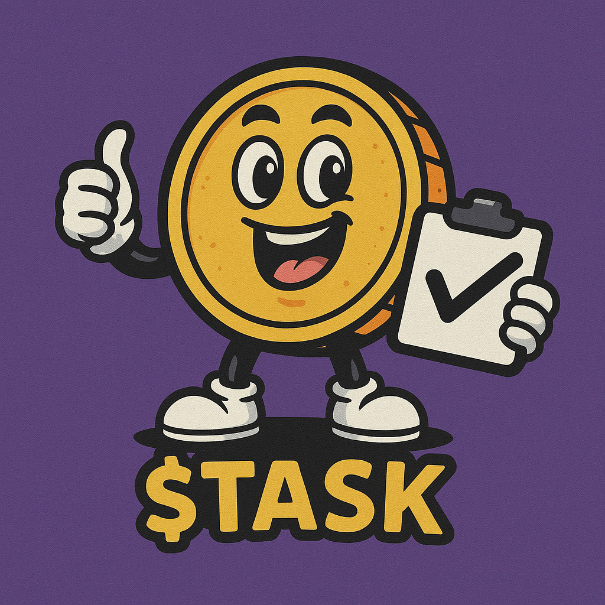
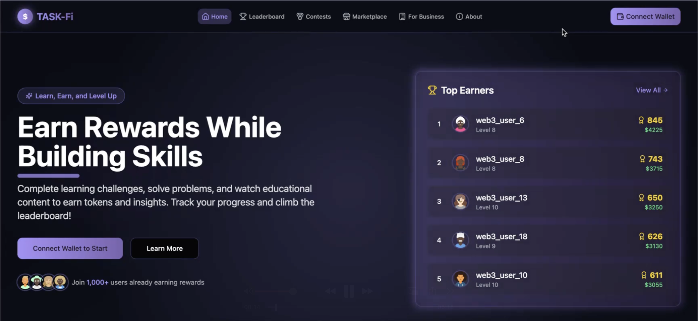
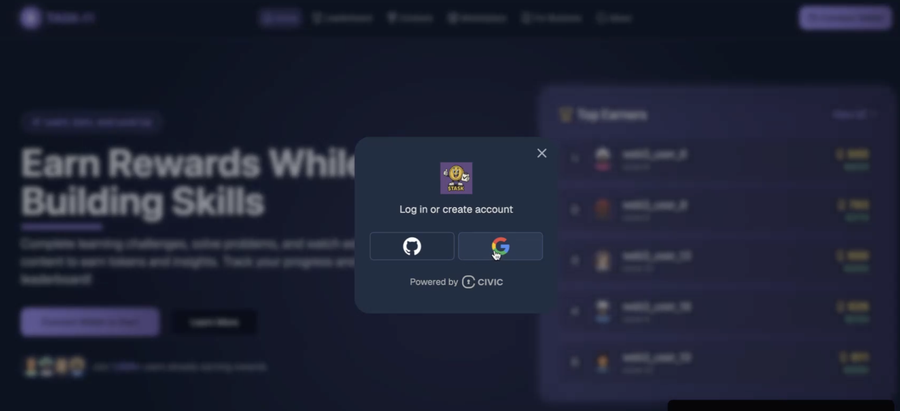

# TaskFi — Your Time, Your Task, Your Tokens



---

**TaskFi** TaskFi ,a gamified, decentralized platform that rewards users with $TASK tokens (built only on SOLANA) for completing productivity tasks, with a marketplace for AI agents to enhance work efficiency, creating a gamified version of learning, earning and having fun. Now doing productivity isnt a burden but a fun activity. Also has features like AI Agent Marketplace, where a freelancer can sell his/her ai agents and services as well like consulting, coding etc. We integrated this as we believe freelancers in web2 medium are not often treated right, - Late payments,hassle. They get diverted from their main path ie- Development and then start going into sales part. We fixed that :) 
Also meet our cute little zappy.



**V1 Launching Very Soon** 

---

##  TaskFi Includes: 
- User onboarding using civic
- Complete daily tasks and make streaks by doing courses, doing leetcode etc
- Participate in our contests to earn $TASK from a large prize pool
- Talk to our ai based web3 assistant called zappy, zappy is there to solve all your queries regarding blockchain and how taskfi works
- Freelancer? Don't worry earn passive income by listing your ai agents and your service, in a transparent medium.
- Gamifying everything; call it a duolingo for productivity

---

## How is Civic Authentication Integration done?

TaskFi uses [**Civic Auth**](https://www.auth.civic.com/dashboard) to deliver **secure, bot-free authentication**, preserve user privacy, and keep authentication integrated within web2 and web3 platforms and seamlessly onboard players to Solana with embedded wallets, by giving embedded wallets. It solves the need of downloading third party wallet and getting relied on them.


### Why Did we choose Civic?
-  Civic offers 1 click implementation which is far better than reading long docs and intergrating auth services
-  Civic keeps record of real players and avoid bots
-  Blocks multiple accounts; attempted by bots to misuse the system
-  It also provides users with embedded wallets (through something called Civic Wallets). This means new users can instantly get a Solana wallet inside your app — without needing to install Phantom, Backpack, etc. separately.

### How Civic is Integrated
- Onboarding of a player is done through **civic**
- Civic verifies that the player is a real human (bot protection) and **automatically creates an embedded Solana wallet** for them if they don't already have one.
- allows to transfer $TASK tokens from civic account to any other wallet, reduces the need of having third party wallet accounts
- Only real players, are able to solve tasks, buy/sell ai agents and their services and participate in pool of contests
- Interaction of $TASK tokens are done via civic, one click onboarding done by team **civic** offers smooth flow.

> Civic ensures that the players in the system are fair and square and system is not being misused.


## Getting Started (For Developers)

To run TaskFi on your machine:

```bash
#Git clone (clone the repo)
https://github.com/divi2806/civic-auth-hack.git

# Install dependencies
npm install

# Run the development server
npm run dev
